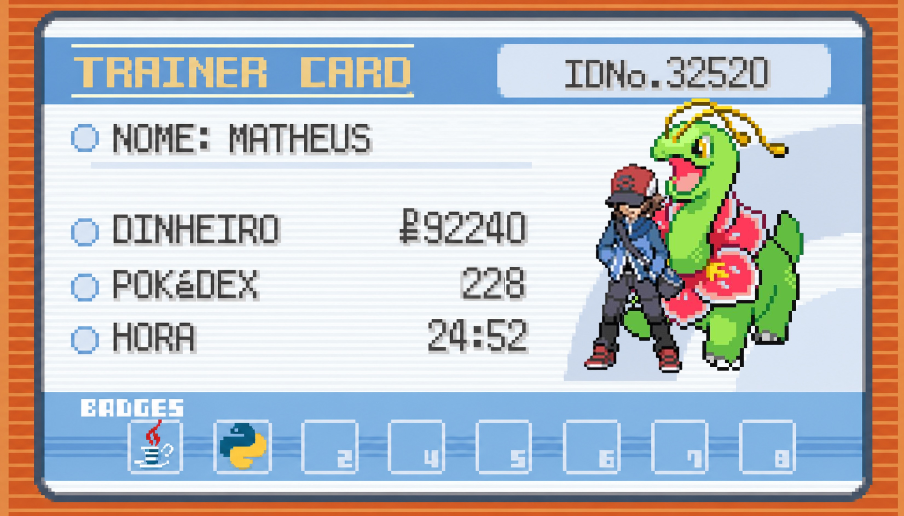

---

## 🐦 About me

🎓 Estudante Técnico em TI na Fundatec

💻 Desenvolvedor em formação

☕ Entusiasta de Java

🚀 Construindo projetos e evoluindo minhas habilidades um commit de cada vez.

---

## 🎒 Perfil do Treinador

- 📍 Canoas, RS
- 🎯 Em busca da minha primeira oportunidade na área de Tecnologia
- 🌱 Atualmente estudando Técnico em TI
- ⚡ Desafio favorito: resolver bugs e aprimorar minha lógica

---

## 🏆 Insígnias Conquistadas

- 🐍 Python
- ☕ Java
- 📂 GitHub
- 💻 VS Code

---

## 🎮 Projetos em Destaque

⚔️ Vs-Eivor

Jogo em texto desenvolvido em Python para praticar lógica de programação, mecânicas de combate e resolução de problemas.

🎲 Jogo do Número Secreto

Projeto focado em estruturas condicionais, repetições e interação com o usuário.

🎵 Spidey Music

Projeto experimental criado para explorar novos conceitos de programação durante meus estudos.

---

## 📈 Missão Atual

- 🔹 Aprimorar minhas habilidades em Python
- 🔹 Aprofundar meus conhecimentos em Java
- 🔹 Desenvolver projetos maiores e mais completos
- 🔹 Aprender conceitos de engenharia de software
- 🔹 Conquistar minha primeira vaga de estágio ou Jovem Aprendiz na área

---

## 📫 Contato

- 📧 Gmail : matheuseufrazio26@gmail.com
- 💼 LinkedIn: https://www.linkedin.com/in/matheus-o-eufrazio-b95823316/

---

## «⚡ "Testando capacidades, um erro de sintaxe por vez."»
